  
  
   
  
  

 

  <table>
    <tr>
      <td valign="top" align="center"></td>
      <td valign="top" align="center"></td>
    </tr>
  </table>
  
   
  
  

---

  
<i>Building scalable web applications, cross-platform mobile tools, and AI/ML pipelines.</i>

### **💻 Languages & Core Systems**

  
  
  
  
  
  
  
  

### **🌐 Web & Mobile Development**

  
  
  
  
  
  
  

### **🤖 AI / Machine Learning & Cloud Data**

  
  
  
  
  
  
  
  
  

### **🎨 Creative Design & Utilities**

  
  
  
  
  

---

   
  
  
    
  

    

  

    

> **Professional Insight:** _Commit-based analytics above represent my full software engineering footprint—including collaborative contributions across organizational repositories and hackathon teams._

---

  <table width="860">
    <tr>
      <td align="center" width="33%" valign="top">
        
          
        <strong> Currently Learning</strong>
          
        • Advanced React Patterns 
        • Next.js 14 Server Components 
        • Applied RAG Architecture
      </td>
      <td align="center" width="33%" valign="top">
        
          
        <strong> Active Builds</strong>
          
        • Full-Stack MERN & Laravel Apps 
        • Generative AI API Integrations 
        • Terminal & Linux Automation
      </td>
      <td align="center" width="33%" valign="top">
        
          
        <strong> Technical Goals</strong>
          
        • Open-Source Contributions 
        • Campus Tech Community Building 
        • Competitive Programming
      </td>
    </tr>
  </table>

    

  

---

  
  
  
  
   
  
  
  <strong style="font-size: 16px; color: #00D9FF;">Always open to collaborative software projects and technical discussions!</strong>
  
  
    
  
    

  

